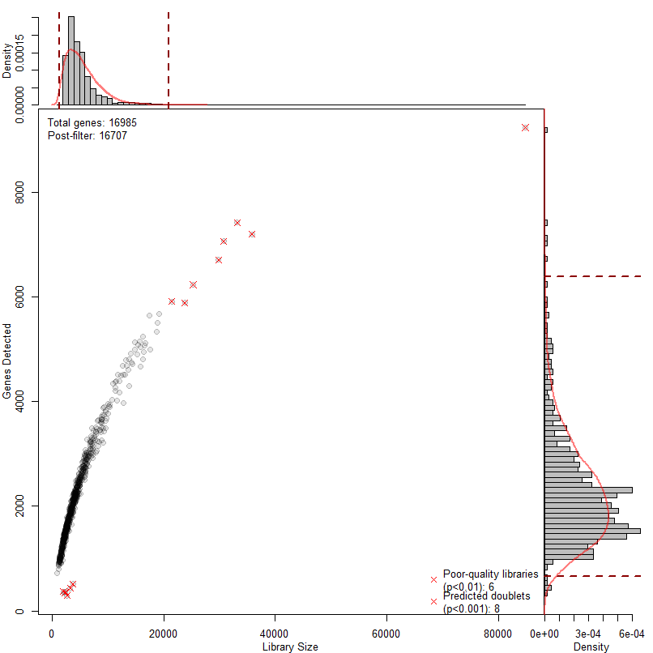
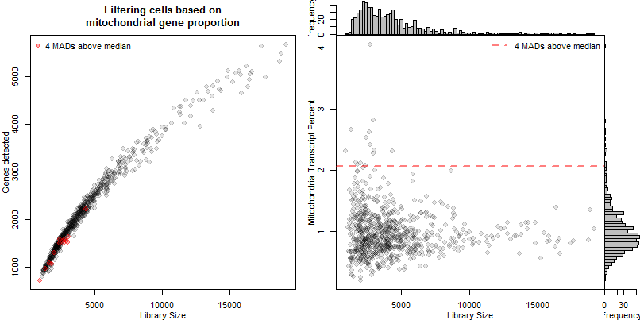
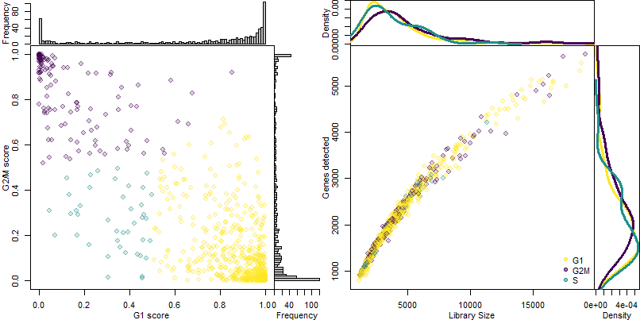
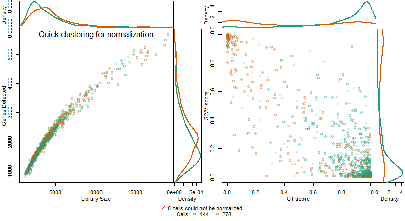
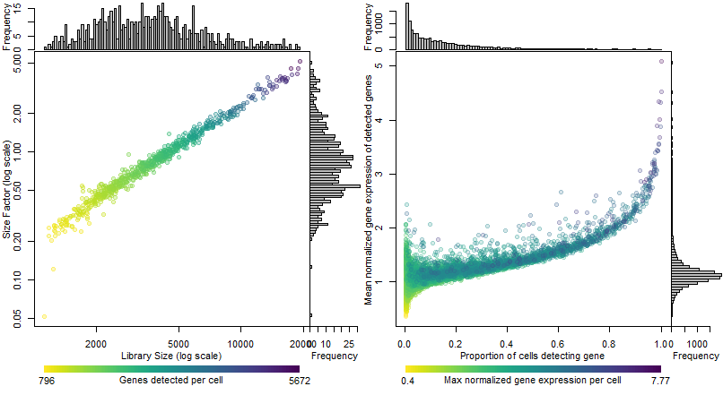

-   [Filtering raw data](#filtering-raw-data)
    -   [Raw cell distributions](#raw-cell-distributions)
    -   [Doublet filtering](#doublet-filtering)
    -   [Mitochondrial gene content](#mitochondrial-gene-content)
    -   [Cell cycle annotation](#cell-cycle-annotation)
    -   [Filter out low abundance
        genes](#filter-out-low-abundance-genes)
-   [Normalization](#normalization)
-   [Clustering by SNN-cliq](#clustering-by-snn-cliq)

Filtering raw data
==================

Raw cell distributions
----------------------

**Genes detected as a function of library size per cell:**

Doublet filtering
-----------------

In order to filter out predicted doublets, library sizes were fit to a
negative binomial distribution and cells unlikely to have been sampled
from those distributions were removed (red x).

Data processing will now be performed based on a published workflow from
the Marioni group (Lun *et al.*, F1000Research 2016.
<http://dx.doi.org/10.12688/f1000research.9501.2>).

Mitochondrial gene content
--------------------------

The majority of cells have less than 1% of transcripts from
mitochondrial genes. This is evidence of generally good-quality data. A
cutoff of 4 median absolute deviations above the median mitochondrial
content was used to remove 14 cells with higher mitochondrial gene
proportion than the data set as a whole. These cells were predominantly
at the low end of the gene detection and library size distributions.
This resulted in the loss of 298 from the total number of genes detected
in the dataset, leaving 16687 genes detected in the dataset.

Cell cycle annotation
---------------------

    ##                   G1   G2M     S
    ## CellCyclePhase 73.3% 20.9% 5.82%

Cell cycle prediction performed by Cyclone (Scialdone *et al.*, Methods
2015. <http://dx.doi.org/10.1016/j.ymeth.2015.06.021>)

Filter out low abundance genes
------------------------------

Noisy genes must be removed to prevent them from skewing normalization.
The filtering method in *Seurat* removes only genes detected in very few
cells, which is sufficient for normalization while removing as few genes
as possible.

Normalization
=============

Next step is normalization. Marioni proposed a normalization technique
that attempts to generate cell-specific size factors that are robust to
differential expression between genes in a heterogenous sample, unlike
simple library-size normalization
(<http://f1000.com/fulltext/doi/10.1186/s13059-016-0947-7>). This method
correlates strongly with library size normalization for homogenous
samples, but solves a series of linear equations to deconvolute
cell-specific size factors for normalization. In order to better handle
heterogenous data, they suggest separating the data by simple
heirarchical clustering of a Spearman correlation-based distance metric
so that they can normalize the separate subpopulations separately to
prevent the suppression of true differential expression during
normalization.

Normalization is carried out by assigning size factors per gene by the
pooling and deconvolution method, then taking the log-ratio between each
count and its size factor, and adding a pseudocount of one.
Log-transforming the data stabilizes variance by reducing the impact of
a few highly variable genes.

Following this, it is suggested to investigate sources of technical
variance, but without spike-ins or any annotated possible sources of
variation, this step is not possible.

    ## Warning in brewer.pal(length(levels(qClust)), "Dark2"): minimal value for n is 3, returning requested palette with 3 different levels

Cells that fail to normalize are generally due to poor information
content (small library size, weak gene expression relative to other
cells).

Clustering by SNN-cliq
======================

Seurat implements an interpretation of SNN-Cliq
(<https://doi.org/10.1093/bioinformatics/btv088>) for clustering of
single-cell expression data. They use PCs to define the distance metric,
then embed the cells in a graph where edges between cells (nodes) are
weighted based on their similarity (euclidean distance in PCA space).
These edge weights are refined based on Jaccard distance (overlap in
local neighbourhoods), and then communities ("quasi-cliques") are
identified in the graph using a smart local moving algorithm (SLM,
<http://dx.doi.org/10.1088/1742-5468/2008/10/P10008>) to optimize the
modularity measure of the defined communities in the graph.  
Cluster resolution is assessed by testing for differential expression
between each cluster and its neighbours using a likelihood-ratio test
designed for single-cell qPCR assays
(<https://doi.org/10.1093/bioinformatics/bts714>). Cluster distributions
are modelled as mixture models, with a discrete component modelling the
likelihood of detecting a gene, and a log-normal component representing
gene expression of detected genes. P-values were adjusted using the
Benjamini–Hochberg method to determine a false discovery rate (FDR), and
the presences of more than one gene differentially expressed with a FDR
tolerance of 5% was considered sufficient evidence that a cluster was
different than its neighbours.
