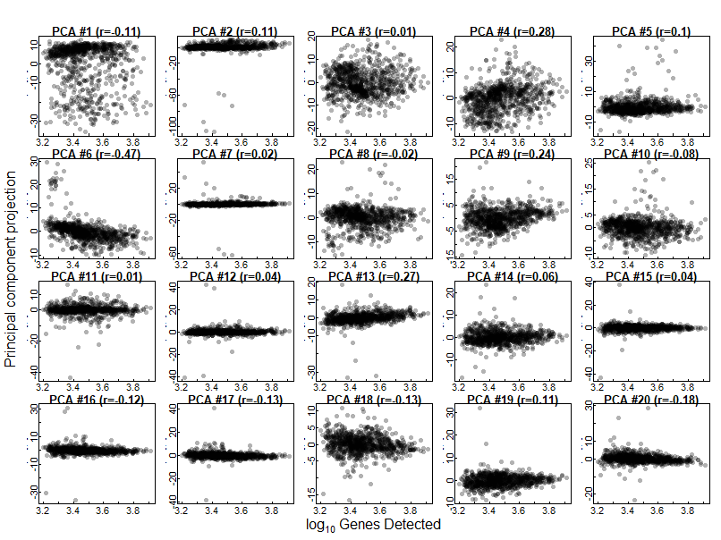
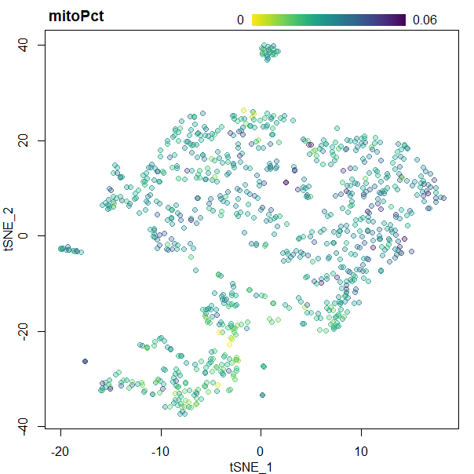
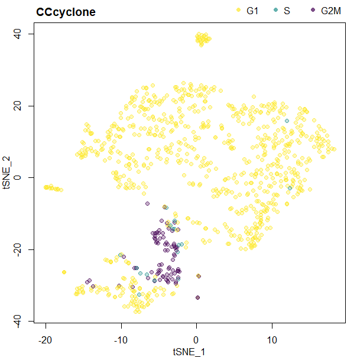
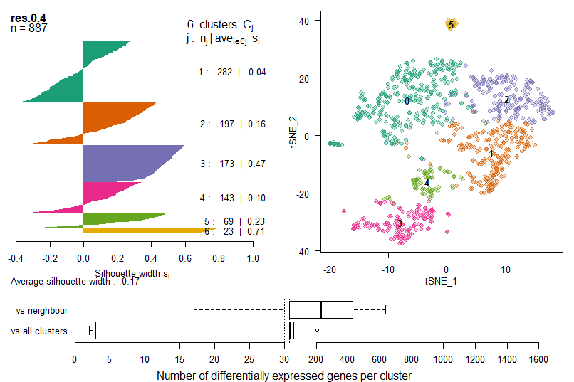
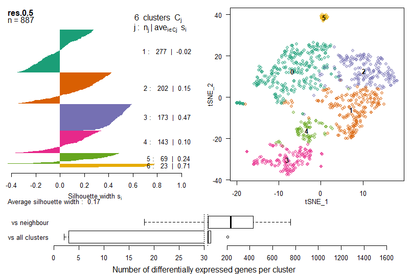
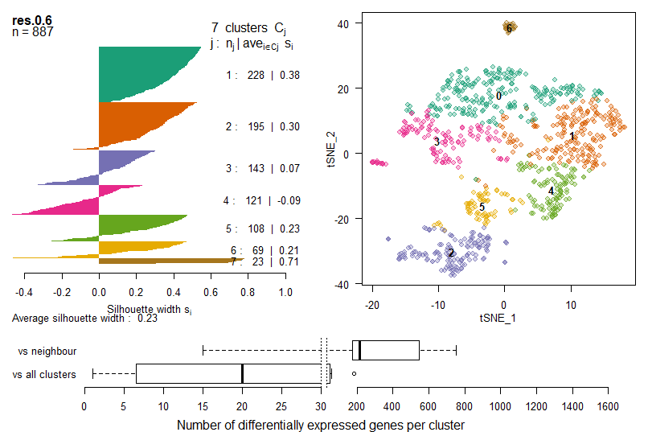
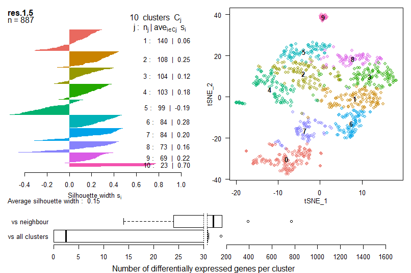
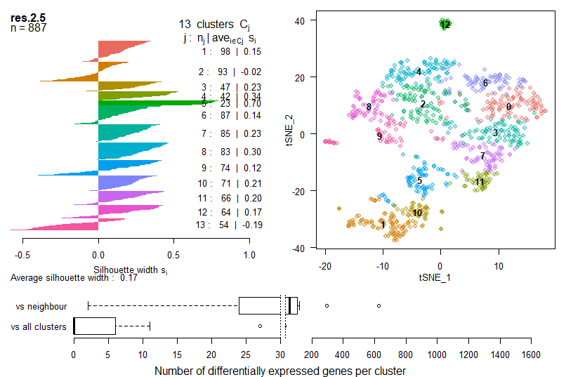
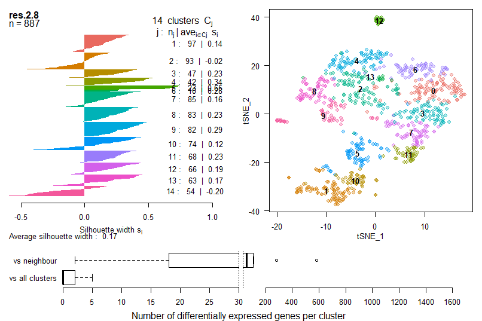

### [Home](/scClustViz)
-   [Clustering using *Seurat*](#clustering-using-seurat)
-   [Clustering by SNN-cliq](#clustering-by-snn-cliq)
    -   [PCA and Spectral tSNE](#pca-and-spectral-tsne)

Clustering using *Seurat*
=========================

    ### Restart your R session between running pipeline_QCN.Rmd and pipeline_Clust.Rmd,
    ### unless you've set the maximum number of DLLs to > 100.  Seurat and scran cannot
    ### be loaded at the same time in R with the default DLL limit of 100.

    dataName <- "10Xneurons" 
    ##  Name your analysis results
    dataPath <- "../scClustViz_files/demo_10Xneurons900/" 
    ##  Path to analysis output directory

    library(scales)
    library(viridis)

    ## Loading required package: viridisLite

    ## 
    ## Attaching package: 'viridis'

    ## The following object is masked from 'package:scales':
    ## 
    ##     viridis_pal

    library(RColorBrewer)
    library(cluster)
    library(pbapply)
    library(Seurat) #see http://satijalab.org/seurat/install.html

    ## Loading required package: ggplot2

    ## Loading required package: cowplot

    ## 
    ## Attaching package: 'cowplot'

    ## The following object is masked from 'package:ggplot2':
    ## 
    ##     ggsave

    ## Loading required package: Matrix

    rainbow2 <- function(n,a=1) {
      require(scales)
      hues = seq(15, 375, length = n + 1)
      alpha(hcl(h = hues, l = 60, c = 100)[1:n],a)
    }

    load(paste0(dataPath,"clustInputs.RData"))

Clustering by SNN-cliq
======================

Seurat implements an interpretation of SNN-Cliq
(<https://doi.org/10.1093/bioinformatics/btv088>) for clustering of
single-cell expression data. They use PCs to define the distance metric,
then embed the cells in a graph where edges between cells (nodes) are
weighted based on their similarity (euclidean distance in PCA space).
These edge weights are refined based on Jaccard distance (overlap in
local neighbourhoods), and then communities ("quasi-cliques") are
identified in the graph using a smart local moving algorithm (SLM,
<http://dx.doi.org/10.1088/1742-5468/2008/10/P10008>) to optimize the
modularity measure of the defined communities in the graph.

PCA and Spectral tSNE
---------------------

    plotPCloadings <- function(
      eb1S,highlight=NULL,components="PCA",nPC=20,
      comparison=c("Timepoint","LibrarySize","GeneDetect","mitoPct","CCcyclone","CCseurat")
    ) {
      if (nPC %% 5 != 0) {
        warning("nPC argument should be multiple of 5")
      }
      if (components == "PCA") { 
        input <- eb1S@dr$pca@cell.embeddings 
      } else if (components == "ICA") {
        input <- eb1S@dr$ica@cell.embeddings
      } else {
        warning("components argument should be in c(\"PCA\",\"ICA\")")
      }
      if (comparison == "Timepoint") {
        compInput <- eb1S@meta.data$orig.ident
      } else if (comparison == "LibrarySize") {
        compInput <- log10(eb1S@meta.data$total_counts)
        comparison <- expression(log[10]~"Library size")
      } else if (comparison == "GeneDetect") {
        compInput <- log10(eb1S@meta.data$total_features)
        comparison <- expression(log[10]~"Genes Detected")
      } else if (comparison == "mitoPct") {
        compInput <- eb1S@meta.data$mitoPct
        comparison <- "Proportion of mitochondrial transcripts detected"
      } else if (comparison == "CCcyclone") {
        compInput <- eb1S@meta.data$cycPhase
      } else if (comparison == "CCseurat") {
        compInput <- eb1S@meta.data$Phase
      } else {
        warning("comparison argument should be in
    c(\"Timepoint\",\"LibrarySize\",\"mitoPct\",\"CCcyclone\",\"CCseurat\")")
      }
      .parDef <- par(no.readonly=T)
      layout(rbind(c(0,rep(nPC+1,5)),
                   cbind(rep(nPC+3,nPC/5),
                         matrix(seq(1,nPC),ncol=5,byrow=T)),
                   c(0,rep(nPC+2,5))),
             widths=c(0.2,rep(1,nPC/5)),
             heights=c(0.2,rep(1,nPC/5),0.2))
      par(mar=c(1,1,1,1),mgp=c(1,0,0),tck=0.02)
      for (i in 1:nPC) {
        if (is.factor(compInput)) {
          temp_density <- tapply(input[,i],compInput,density)
          plot(x=NULL,y=NULL,main=paste0(components," #",i),ylab=NA,xlab=NA,
               xlim=range(sapply(temp_density,function(X) range(X$x))),
               ylim=range(sapply(temp_density,function(X) range(X$y))))
          rect(par("usr")[1],par("usr")[3],par("usr")[2],par("usr")[4],col="grey70")
          for (l in seq_along(temp_density)) {
            lines(temp_density[[l]],lwd=3,col=viridis(length(temp_density),.6,1,0)[l])
          }
        } else {
          plot(x=compInput,y=input[,i],pch=16,col=alpha("black",0.3),
               main=paste0(components," #",i," (r=",round(cor(compInput,input[,i]),2),")"))
        }
        if (i %in% highlight) { box(lwd=2,col="red") }
      }
      par(mar=c(0,0,0,0))
      if (is.factor(compInput)) {
        plot.new()
        legend(col=viridis(length(temp_density),1,1,0),lwd=3,
               legend=names(temp_density),x="center",horiz=T,bty="n")
        plot.new()
        mtext("Principal component projection",1,line=-1.5)
        plot.new()
        mtext("Density",2,line=-1.5)
      } else {
        plot.new()
        plot.new()
        mtext(comparison,1,line=-1.5)
        plot.new()
        mtext("Principal component projection",2,line=-1.5)
      }
      par(.parDef)
    }

    plotTSNEbatch <- function(
      eb1S,
      colour=c("Timepoint","LibrarySize","GeneDetect","mitoPct","CCcyclone","CCseurat")
    ) {
      if (colour == "Timepoint") {
        colourVector <- eb1S@meta.data$orig.ident
        colourLength <- length(levels(eb1S@meta.data$orig.ident))
        rnd <- sample(1:nrow(eb1S@dr$tsne@cell.embeddings),
                      size=nrow(eb1S@dr$tsne@cell.embeddings))
      } else if (colour == "LibrarySize") {
        inputVal <- "total_counts"
        colourVector <- cut(log10(eb1S@meta.data$total_counts),breaks=100,labels=F)
        colourLength <- 100
        colourScale <- "(log scale)"
        rnd <- 1:nrow(eb1S@dr$tsne@cell.embeddings)
      } else if (colour == "GeneDetect") {
        inputVal <- "total_features"
        colourVector <- cut(log10(eb1S@meta.data$total_features),breaks=100,labels=F)
        colourLength <- 100
        colourScale <- "(log scale)"
        rnd <- 1:nrow(eb1S@dr$tsne@cell.embeddings)
      } else if (colour == "mitoPct") {
        inputVal <- "mitoPct"
        colourVector <- cut(eb1S@meta.data$mitoPct,breaks=100,labels=F)
        colourLength <- 100
        colourScale <- ""
        rnd <- 1:nrow(eb1S@dr$tsne@cell.embeddings)
      } else if (colour == "CCcyclone") {
        colourVector <- eb1S@meta.data$cycPhase
        colourLength <- length(levels(eb1S@meta.data$cycPhase))
        rnd <- 1:nrow(eb1S@dr$tsne@cell.embeddings)
      } else if (colour == "CCseurat") {
        colourVector <- eb1S@meta.data$Phase
        colourLength <- length(levels(eb1S@meta.data$Phase))
        rnd <- 1:nrow(eb1S@dr$tsne@cell.embeddings)
      } else {
        warning("colour argument should be in
    c(\"Timepoint\",\"LibrarySize\",\"mitoPct\",\"CCcyclone\",\"CCseurat\")")
      }
      plot(eb1S@dr$tsne@cell.embeddings[rnd,],pch=21,xlab="tSNE_1",ylab="tSNE_2",
           col=viridis(colourLength,.7,d=-1)[colourVector[rnd]],
           bg=viridis(colourLength,.3,d=-1)[colourVector[rnd]])
      if (is.factor(colourVector)) {
        title(main=colour,adj=0.01)
        if (length(levels(colourVector)) <= 3) {
          legend("topright",xpd=NA,inset=c(0,-.08),bty="n",horiz=T,
                 legend=levels(colourVector),pch=16,
                 col=viridis(colourLength,.7,d=-1)[seq_along(levels(colourVector))])
        } else {
          legend("topright",xpd=NA,inset=c(0,-.08),bty="n",
                 ncol=ceiling(length(levels(colourVector))/2),
                 legend=levels(colourVector),pch=16,
                 col=viridis(colourLength,.7,d=-1)[seq_along(levels(colourVector))])
        }
      } else {
        title(main=colour,adj=0.01)
        segments(x0=seq(quantile(range(eb1S@dr$tsne@cell.embeddings[,1]),.5),
                        quantile(range(eb1S@dr$tsne@cell.embeddings[,1]),.9),length.out=1000),
                 y0=max(eb1S@dr$tsne@cell.embeddings[,2]) * 1.1,
                 y1=max(eb1S@dr$tsne@cell.embeddings[,2]) * 1.16,
                 col=viridis(1000,d=-1),xpd=NA)
        text(x=c(quantile(range(eb1S@dr$tsne@cell.embeddings[,1]),.5),
                 quantile(range(eb1S@dr$tsne@cell.embeddings[,1]),.7),
                 quantile(range(eb1S@dr$tsne@cell.embeddings[,1]),.9)),
             y=rep(max(eb1S@dr$tsne@cell.embeddings[,2]) * 1.13,3),
             labels=c(round(min(eb1S@meta.data[,inputVal]),2),
                      colourScale,
                      round(max(eb1S@meta.data[,inputVal]),2)),
             pos=2:4,xpd=NA)
      }
    }

    if (!file.exists(paste0(dataPath,"postPCA.RData"))) {
      eb1S <- CreateSeuratObject(ebNorm,dataName,meta.data=as.data.frame(pDat),
                                 min.cells=0,min.genes=0,save.raw=F)
      data("cc.genes")  
      eb1S <- CellCycleScoring(eb1S,g2m.genes=cc.genes$g2m.genes,s.genes=cc.genes$s.genes)
      ##  If using mouse data, this will give a warning before doing case-insentive matching.
      ##  This is because the cell cycle gene names used are from human.
      eb1S@meta.data$Phase <- factor(eb1S@meta.data$Phase,levels=c("G1","S","G2M"))
      if (exists("hvg")) {
        eb1S@var.genes <- rownames(hvg)
      } else {
        eb1S@var.genes <- rownames(ebNorm)
      }
      eb1S <- ScaleData(eb1S,display.progress=F,check.for.norm=F)
      eb1S <- RunPCA(eb1S,pcs.compute=40,pc.genes=eb1S@var.genes,do.print=F)
      save(eb1S,file=paste0(dataPath,"postPCA.RData"))
    } else {
      load(paste0(dataPath,"postPCA.RData"))
      print(paste("Data loaded from",paste0(dataPath,"postPCA.RData")))
    }

    ## [1] "Data loaded from ../scClustViz_files/demo_10Xneurons900/postPCA.RData"

    rm(list=ls()[!ls() %in% c("eb1S","timePoints","dataPath",
                              "plotPCloadings","plotTSNEbatch","rainbow2")])
    gc()

    ##            used (Mb) gc trigger  (Mb) max used  (Mb)
    ## Ncells  3033107  162    4716652 251.9  4716652 251.9
    ## Vcells 25811305  197   45641246 348.3 30107849 229.8

    plotPCloadings(eb1S,comparison="LibrarySize",nPC=20)
    plotPCloadings(eb1S,comparison="GeneDetect",nPC=20)
    plotPCloadings(eb1S,comparison="mitoPct",nPC=20)
    plotPCloadings(eb1S,comparison="CCcyclone",nPC=20)
    plotPCloadings(eb1S,comparison="CCseurat",nPC=20)

It is important to assess the impact of technical factors on downstream
clustering. Here we determine whether there are tecnical effects
represented in the principal component projections, and the subsequent
spectral tSNE projection.

Technical confounders assessed:  
- Library size  
- Gene detection rate (strongly correlated with library size)  
- Mitochondrial transcript detection proportion  
- Cell cycle stage as predicted by *cyclone* - Cell cycle stage as
predicted by *Seurat*

As you can see, there is a weak correlation between the first PC and
mitochondrial transcript proportion, suggesting that cell damage may
effect clustering results. You could re-run the PCA after using the
`vars.to.regress` argument in the *Seurat* `ScaleData` command. Since
PCA results are saved to disk in this pipeline, when re-running make
sure to either rename or delete the original `postPCA.RData` file in
your data path.

    ### Selecting number of PCs to use.  Run this code block once, then set maxPCt.
    maxPCt <- 10
    ##  Number of PCs to use for downstream analysis, chosen from elbow of scree plot.
    PCuse <- seq(1,maxPCt) 

    par(mar=c(3,3,1,1),mgp=2:0)
    plot(seq_along(eb1S@dr$pca@sdev),eb1S@dr$pca@sdev,
         xlab="Principal Component",ylab="Standard Deviation of PC")
    Hmisc::minor.tick(nx=5,ny=1)

    points(maxPCt,eb1S@dr$pca@sdev[maxPCt],type="h",col="darkred")
    arrows(x0=0.5,y0=eb1S@dr$pca@sdev[maxPCt]-.2,
           x1=maxPCt-.1,y1=eb1S@dr$pca@sdev[maxPCt]-.2,
           col="darkred",code=3,length=.1)
    text(x=maxPCt/2,y=eb1S@dr$pca@sdev[maxPCt]-.2,pos=1,
         labels="PCs used",col="darkred")

    eb1S <- RunTSNE(eb1S,dims.use=PCuse,perplexity=30)
    ##  Default perplexity is 30, but should be set lower with small numbers of cells.
    par(mar=c(3,3,2,1),mgp=2:0)
    plotTSNEbatch(eb1S,colour="LibrarySize")
    plotTSNEbatch(eb1S,colour="GeneDetect")
    plotTSNEbatch(eb1S,colour="mitoPct")
    plotTSNEbatch(eb1S,colour="CCcyclone")
    plotTSNEbatch(eb1S,colour="CCseurat")

    if (!file.exists(paste0(dataPath,"eb1S.RData"))) {
      ######## User-defined variables ########
      exponent <- 2  
      ##  Log base of your normalized input data.  
      ##  Seurat defaults to natural log (set this to exp(1)), 
      ##  other methods are generally log2 (set this to 2).
      pseudocount <- 1 
      ##  Pseudocount added to all log-normalized values in your input data.  
      ##  Most methods use a pseudocount of 1 to eliminate log(0) errors.
      logFCthresh <- 1 
      ##  Magnitude of mean log-expression fold change to use as a minimum threshold 
      ##  for DE testing
      WRSTalpha <- 0.01 
      ##  significance level for DE testing using Wilcoxon rank sum test
      
      ######## Functions ########
      mean.logX <- function(data,ex=exponent,pc=pseudocount) { 
        log(mean(ex^data - pc) + 1/ncol(eb1S@data),base=ex) 
      }
      ##  ^ Adding a pseudocount of 1 to the logMean prior to logFC calculations skews the 
      ##  result quite dramatically, so instead we add a small pseudocount to avoid +/- inf 
      ##  results when means are zero, without the same skewing.  Adding a very small number 
      ##  means that means of zero get set to a large negative log-mean, when it might be 
      ##  more appropriate to have those values fall closer to the smallest non-zero log-mean.
      ##  By using a pseudocount of 1 / number of samples, we ensure that log(zero) is smaller 
      ##  than any non-zero log-mean, while still being in the same ballpark.
      
      ######## Iteratively cluster and build DE sets ######## 
      CGS <- deTissue <- deVS <- deMarker <- deNeighb <- list()
      resVal <- 0; minNeighbDE <- 100
      while (minNeighbDE > 0) {
        if (minNeighbDE <= 30) {
          resVal <- resVal + 0.1
        } else {
          resVal <- resVal + 0.2
        }
        print("")
        print("")
        print(paste0("~~~~~~~~~~~~ Clustering at res.",resVal," ~~~~~~~~~~~~"))
        if (!any(grepl("^res",colnames(eb1S@meta.data)))) {
          eb1S <- FindClusters(eb1S,reduction.type="pca",dims.use=PCuse,k.param=30,
                               print.output=F,resolution=resVal,
                               algorithm=3,n.start=100,n.iter=100,save.SNN=T)
          ##  30 is the default K, but as with tSNE perplexity, a smaller value might be
          ##  more appropriate with small cell numbers.
          print(paste(length(levels(eb1S@ident)),"clusters identified"))
        } else {
          eb1S <- FindClusters(eb1S,print.output=F,resolution=resVal,
                               algorithm=3,n.start=100,n.iter=100,reuse.SNN=T)
          print(paste(length(levels(eb1S@ident)),"clusters identified"))
          if (all(eb1S@meta.data[,ncol(eb1S@meta.data)-1] == 
                  eb1S@meta.data[,ncol(eb1S@meta.data)])) { 
            eb1S@meta.data <- eb1S@meta.data[,-ncol(eb1S@meta.data)]
            next 
          }
        }
        res <- colnames(eb1S@meta.data)[length(colnames(eb1S@meta.data))]
        
        #### Precalculate stats for viz tool ####
        print("")
        print("")
        print(paste("Calculating cluster gene summary statistics for",res))
        print("-- Gene detection rate per cluster --")
        DR <- pbapply(eb1S@data,1,function(X) tapply(X,eb1S@ident,
                                                     function(Y) sum(Y>0)/length(Y)))
        print("-- Mean detected gene expression per cluster --")
        MDTC <- pbapply(eb1S@data,1,function(X) tapply(X,eb1S@ident,function(Y) {
          temp <- mean.logX(Y[Y>0])
          if (is.na(temp)) { temp <- 0 }
          return(temp)
        }))
        print("-- Mean gene expression per cluster --")
        MTC <- pbapply(eb1S@data,1,function(X) tapply(X,eb1S@ident,mean.logX))
        if (length(levels(eb1S@ident)) <= 1) {
          CGS[[res]] <- list(data.frame(DR=DR,MDTC=MDTC,MTC=MTC))
          names(CGS[[res]]) <- levels(eb1S@ident)
          next
        } else {
          CGS[[res]] <- sapply(levels(eb1S@ident),function(X) 
            data.frame(DR=DR[X,],MDTC=MDTC[X,],MTC=MTC[X,]),simplify=F)
        }
        
        #### deTissue - DE per cluster vs all other data ####
        print("")
        print(paste("Calculating DE vs tissue for",res,"with",
                    length(levels(eb1S@ident)),"clusters"))
        print("-- LogFC calculations --")
        deT_logFC <- pbsapply(levels(eb1S@ident),function(i) 
          MTC[i,] - apply(eb1S@data[,eb1S@ident != i],1,mean.logX))
        deT_genesUsed <- apply(deT_logFC,2,function(X) which(X > logFCthresh))  
        if (any(sapply(deT_genesUsed,length) < 1)) {
          stop(paste0("logFCthresh should be set to less than ",
                      min(apply(deT_logFC,2,function(X) max(abs(X)))),
                      ", the largest magnitude logFC between cluster ",
                      names(which.min(apply(deT_logFC,2,function(X) max(abs(X))))),
                      " and the remaining data."))
        }
        print("-- Wilcoxon rank sum calculations --")
        deT_pVal <- pbsapply(levels(eb1S@ident),function(i)
          apply(eb1S@data[deT_genesUsed[[i]],],1,function(X) 
            wilcox.test(X[eb1S@ident == i],X[eb1S@ident != i])$p.value),simplify=F)
        deTissue[[res]] <- sapply(levels(eb1S@ident),function(i) 
          data.frame(logFC=deT_logFC[deT_genesUsed[[i]],i],
                     pVal=deT_pVal[[i]])[order(deT_pVal[[i]]),],simplify=F)
        tempQval <- tapply(p.adjust(do.call(rbind,deTissue[[res]])$pVal,"fdr"),
                           rep(names(sapply(deTissue[[res]],nrow)),
                               sapply(deTissue[[res]],nrow)),c)
        for (i in names(deTissue[[res]])) { deTissue[[res]][[i]]$qVal <- tempQval[[i]] }
        
        #### deMarker - DE per cluster vs each other cluster #### 
        combos <- combn(levels(eb1S@ident),2)
        colnames(combos) <- apply(combos,2,function(X) paste(X,collapse="-"))
        print("")
        print(paste("Calculating marker DE for",res,"with",
                    ncol(combos),"combinations of clusters"))
        deM_dDR <- apply(combos,2,function(i) DR[i[1],] - DR[i[2],])
        deM_logFC <- apply(combos,2,function(i) MTC[i[1],] - MTC[i[2],])
        deM_genesUsed <- sapply(colnames(deM_logFC),function(X) 
          which(abs(deM_logFC[,X]) > logFCthresh),simplify=F)
        if (any(sapply(deM_genesUsed,length) < 1)) {
          stop(paste0("logFCthresh should be set to less than ",
                      min(apply(deM_logFC,2,function(X) max(abs(X)))),
                      ", the largest magnitude logFC between clusters ",
                      names(which.min(apply(deM_logFC,2,function(X) max(abs(X))))),"."))
        }
        deM_pVal <- pbsapply(colnames(combos),function(i)
          apply(eb1S@data[deM_genesUsed[[i]],],1,function(X) 
            suppressWarnings(wilcox.test(X[eb1S@ident == combos[1,i]],
                                         X[eb1S@ident == combos[2,i]])$p.value)),simplify=F)
        temp_deVS <- sapply(colnames(combos),function(i) 
          data.frame(dDR=deM_dDR[deM_genesUsed[[i]],i],logFC=deM_logFC[deM_genesUsed[[i]],i],
                     pVal=deM_pVal[[i]])[order(deM_pVal[[i]]),],simplify=F)
        tempQval <- tapply(p.adjust(do.call(rbind,temp_deVS)$pVal,"fdr"),
                           rep(names(sapply(temp_deVS,nrow)),sapply(temp_deVS,nrow)),c)
        for (i in names(temp_deVS)) { temp_deVS[[i]]$qVal <- tempQval[[i]] }
        
        deVS[[res]] <- sapply(levels(eb1S@ident),function(i) {
          combos <- strsplit(names(temp_deVS),"-")
          temp <- list()
          for (X in seq_along(combos)) {
            if (! i %in% combos[[X]]) {
              next
            } else if (which(combos[[X]] == i) == 1) {
              temp[[combos[[X]][2]]] <- temp_deVS[[X]][temp_deVS[[X]]$logFC > 0 & 
                                                         temp_deVS[[X]]$qVal < WRSTalpha,]
            } else if (which(combos[[X]] == i) == 2) {
              temp[[combos[[X]][1]]] <- temp_deVS[[X]][temp_deVS[[X]]$logFC < 0 & 
                                                         temp_deVS[[X]]$qVal < WRSTalpha,]
              temp[[combos[[X]][1]]]$dDR <- temp[[combos[[X]][1]]]$dDR * -1
              temp[[combos[[X]][1]]]$logFC <- temp[[combos[[X]][1]]]$logFC * -1
            }
          }
          return(temp)
        },simplify=F)
        
        deMarker[[res]] <- sapply(deVS[[res]],function(X) {
          markerGenes <- Reduce(intersect,lapply(X,rownames))
          temp <- sapply(X,function(Y) Y[markerGenes,c("dDR","logFC","qVal")],simplify=F)
          names(temp) <- paste("vs",names(temp),sep=".")
          return(do.call(cbind,temp))
        },simplify=F)
        
        #### deNeighb - DE between closest neighbouring clusters ####
        nb <- apply(dist(apply(eb1S@dr$tsne@cell.embeddings,2,
                               function(X) tapply(X,eb1S@ident,mean)),diag=T,upper=T),2,
                    function(Z) names(which.min(Z[Z > 0])))
        
        deNeighb[[res]] <- mapply(function(NB,VS) 
          VS[[NB]][,c("dDR","logFC","qVal")],NB=nb,VS=deVS[[res]],SIMPLIFY=F)
        for (i in names(deNeighb[[res]])) {
          colnames(deNeighb[[res]][[i]]) <- paste("vs",nb[i],
                                                  colnames(deNeighb[[res]][[i]]),sep=".")
        }
        minNeighbDE <- min(sapply(deNeighb[[res]],nrow))
      }
      save(eb1S,CGS,deTissue,deMarker,deNeighb,deVS,deNeighb,file=paste0(dataPath,"eb1S.RData"))
    } else {
      #### Static visualization of clustering results ####
      ##  This is done seperately from the processing, because occassionally RStudio crashes
      ##  while making figures, and having that interrupt the slow clustering loop sucks.
      load(paste0(dataPath,"eb1S.RData"))
      print(paste("Data loaded from",paste0(dataPath,"eb1S.RData")))

      temp_max <- max(unlist(sapply(deNeighb,function(X) sapply(X,nrow))))
      for (res in grep("^res",colnames(eb1S@meta.data),value=T)) {
        temp_cl <- as.factor(eb1S@meta.data[,res])
        if (length(levels(temp_cl)) <= 8) {
          clustCols <- brewer.pal(length(levels(temp_cl)),"Dark2")[1:length(levels(temp_cl))]
        } else {
          clustCols <- rainbow2(length(levels(temp_cl)))
        }
        
        layout(matrix(c(1,4,2,3),2),heights=c(3,1))
        par(mar=c(4,1,3,3),mgp=2:0)
        tempSil <- silhouette(as.integer(temp_cl),
                              dist(eb1S@dr$pca@cell.embeddings[,seq(1,maxPCt)],method="euclidean"))
        plot(tempSil,main=res,col=clustCols,border=NA)
        
        par(mar=c(3,3,1,1),mgp=2:0)
        plot(eb1S@dr$tsne@cell.embeddings,pch=21,xlab="tSNE_1",ylab="tSNE_2",
             col=alpha(clustCols[temp_cl],.7),
             bg=alpha(clustCols[temp_cl],.3))
        text(apply(eb1S@dr$tsne@cell.embeddings,2,function(X) tapply(X,temp_cl,mean)),
             labels=levels(temp_cl),font=2)    
        
        par(mar=c(3.5,0.2,1,1))
        plot(x=NA,y=NA,xlim=c(30,temp_max+20),ylim=c(0.5,2.5),
             xaxs="i",yaxt="n",frame.plot=F,ylab="",xlab="",lab=c(10,5,7))
        boxplot(cbind(sapply(deMarker[[res]],nrow),
                      sapply(deNeighb[[res]],nrow)),
                add=T,horizontal=T,frame.plot=F,yaxt="n",xaxt="n")
        abline(v=30,lty=3)
        
        par(mar=c(3.5,6,1,0.2))
        plot(x=NA,y=NA,xlim=c(-1,30),ylim=c(0.5,2.5),
             xaxs="i",yaxt="n",frame.plot=F,ylab="",xlab="")
        boxplot(cbind(sapply(deMarker[[res]],nrow),
                      sapply(deNeighb[[res]],nrow)),
                add=T,horizontal=T,frame.plot=F,yaxt="n",xaxt="n")
        abline(v=30,lty=3)
        par(las=1,mgp=c(0,0,0))
        axis(2,at=1:2,labels=c("vs all clusters","vs neighbour"),lty=0)
        mtext("Number of differentially expressed genes per cluster",
              side=1,line=2.5,at=30,xpd=NA)
      }
    }

    ## [1] "Data loaded from ../scClustViz_files/demo_10Xneurons900/eb1S.RData"

    if (!file.exists(paste0(dataPath,eb1S@project.name,"_forViz.RData"))) {
      #### Convert to scClustViz inputs ####
      nge <- eb1S@data  
      ##  ^ normalized gene expression matrix (matrix: genes x cells)
      md <- eb1S@meta.data[,!grepl("^res",colnames(eb1S@meta.data))]  
      ##  ^ metadata for cells (dataframe of cells)
      if (is.data.frame(eb1S@meta.data[,grepl("^res",colnames(eb1S@meta.data))])) {
        cl <- data.frame(lapply(eb1S@meta.data[,grepl("^res",colnames(eb1S@meta.data))],
                                as.factor))
      } else {
        cl <- data.frame(eb1S@meta.data[,grepl("^res",colnames(eb1S@meta.data))])
        colnames(cl) <- grep("^res",colnames(eb1S@meta.data),value=T)
      }
      rownames(cl) <- rownames(md) 
      ##  ^ cluster assignments per clustering resolution 
      ##  (dataframe: cells x cluster labels as factors)
      dr_clust <- eb1S@dr$pca@cell.embeddings[,eb1S@calc.params$RunTSNE$dims.use]  
      ##  ^ cell embeddings in low-dimensional space used for clustering distances 
      ##  (matrix: cells x dimensions)
      ##  Only including those dimensions used in downstream analysis 
      ##  (ie. those passed to RunTSNE and FindClusters)
      ##  if that information is present (in calc.params).  
      ##  Else, using all lower dimensions available.
      dr_viz <- eb1S@dr$tsne@cell.embeddings  
      ##  ^ cell embeddings in 2D space for visualization 
      ##  (usually tSNE) (matrix: cells x coordinates)
      
      #### Save outputs for visualization ####
      save(nge,md,cl,dr_clust,dr_viz,
           CGS,deTissue,deMarker,deNeighb,
           file=paste0(dataPath,eb1S@project.name,"_forViz.RData"))
      ##  ^ Saved objects for use in visualization script (RunVizScript.R).
    } else {
      print(paste("Did not overwrite",paste0(dataPath,"_forViz.RData")))
    }

    ## [1] "Did not overwrite ../scClustViz_files/demo_10Xneurons900/_forViz.RData"
